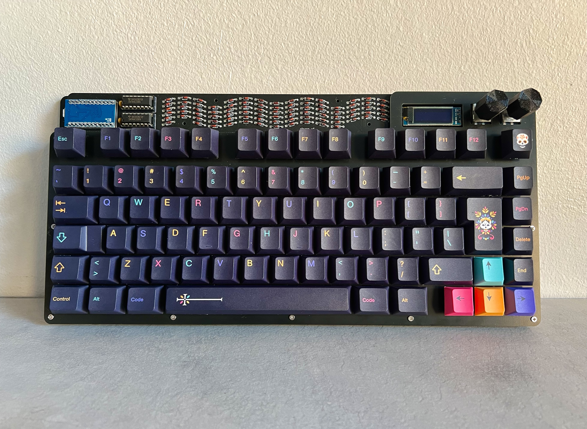
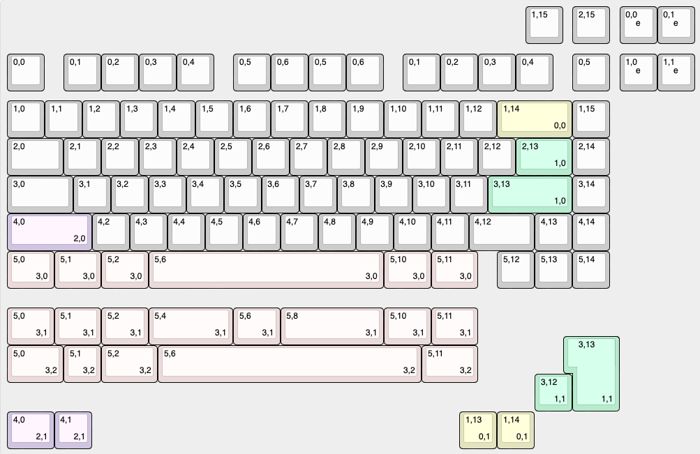
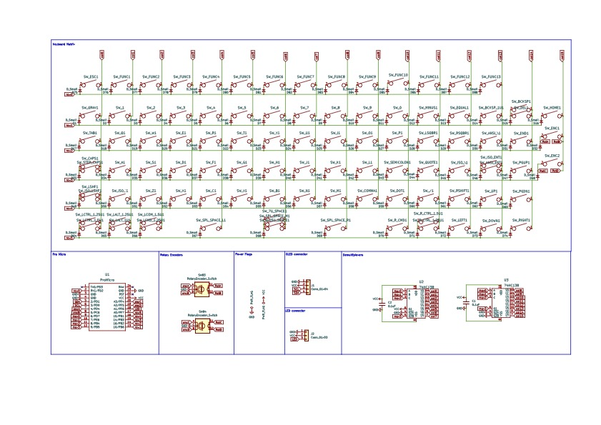

# större
Större is an easy to build 75% keyboard using only through hole components. It uses a separate microcontroller (like the Pro Micro, Elite C or something RP2040 based) to enable flexibility in firmware and connectivity and to further simplify the soldering experience (no more tricksy USB ports). Demultiplexers and a custom matrix are used to enable the size and features of the board with only the pinouts of a pro micro. 

**större kits are available for sale at [sthlmkb.com](https://sthlmkb.com/shop/storre-keyboard-kit/)**

[License](LICENSE)

Lagom is licensed under the [Creative Commons Attribution-NonCommercial 4.0 International license](https://creativecommons.org/licenses/by-nc/4.0/). This design as it stands in this repository may be freely reproduced, modified, and manufactured for PERSONAL USE ONLY and may not be reproduced in physical form for public sale. 

## Designs that are here:
* Storre (i.e this directory) - this is the main PCB
* Storre Plate (`storre_plate`) - this is the plate that holds the switches and goes above the PCB
* Storre Base (`storre_base`) - this is the base of the board and goes below the PCB

## Some useful images/documentation:

This the key layout and all option layouts exported from keyboard-layout-editor

This is the schematic of the keyboard. See a higher res version [here](schematic.pdf)
